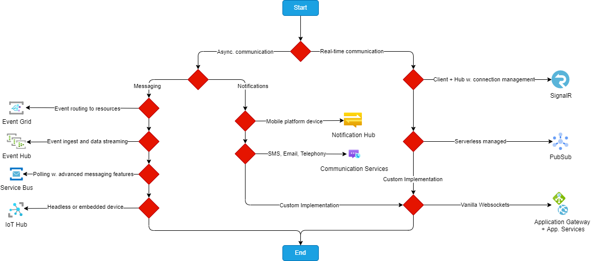
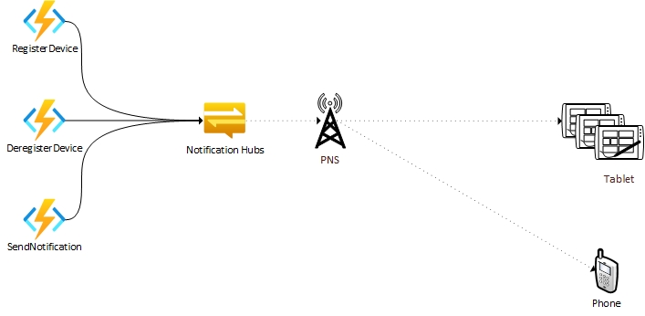

# About The Project

In this repository you'll find assets demonstrating the different messaging capabilities offered by Azure.  The asset is designed in such a way that it attempts to demonstrate each resources capabilities for a specific use case

## Contents

In this project we will deploy:

- Infrastructure for sending notifications and messages
- Services powered by Azure Functions
- .NET Maui Android app for receiving notifications and messages

## Prerequisites

- Azure Subscription
- Firebase project
  - [Getting started with Firebase](https://cloud.google.com/firestore/docs/client/get-firebase)
- Android Device or Emulator using API 29+
  - [Android Emulator Setup](https://learn.microsoft.com/en-us/xamarin/android/get-started/installation/android-emulator/)

## Project Components

- Infrastructure
  - Terraform Definitions
    - Notificaiont Hub
    - Azure Functions
      - App. Service Plan
      - Storage Account

- Services
  - Azure Functions
    - Notification Hub
      - Register Device
      - Deregister Device
      - Send Notification

- Clients
  - Maui Android App

- CI/CD
  - Azure Functions deployment workflow

## Services Selection

Use the decistion tree below to determine the type of implementation you need. Do you require async. or sync messaging? Do you need notifications instead?



## Architecture

### Notification Hub



## Setup

### Mobile Device Push Notifications with Azure Notificatin Hub

This setup will enable Push Notifications to mobile devices using `Notification Hub` as the broker to Firebase.  The Azur resources used will be `Notification Hub` and `Azure Functions`.  For it all to work you will need to make sure you have a project configured in Firebase (see step 4).

1. Infrastructure  
  1.1 Use the provided [Notification Hub Demo defintion](infrastructure/terraform/notification-hub-demo/main.tf)  
  1.2 Use Azure CLI  
    - [Notification Hub](https://learn.microsoft.com/en-us/azure/notification-hubs/create-notification-hub-azure-cli)
    - [Azure Functions](https://learn.microsoft.com/en-us/azure/azure-functions/create-first-function-cli-csharp?tabs=azure-cli%2Cin-process#create-supporting-azure-resources-for-your-function)
2. Deploy backend services using [`deploy-functions` workfow](./.github/workflows/deploy-functions.yaml)
3. Add a `static class` at the root of the Maui project called `Local.Constants.cs`  
  3.1 Replace content with code below. Update values wit your function endpoint and token  

  ```cs
    internal class Local_Constants
    {
        public const string NH_REGISTRATION_UPSERT_ENDPOINT = "<function-endpoint-sans-token>";
        public const string NH_REGISTRATION_FUNC_TOKEN = "<function-token>";
    }
  ```

4. Configure Maui Firebase integration  
  4.1 [Import `google-services.json`](https://learn.microsoft.com/en-us/azure/notification-hubs/xamarin-notification-hubs-push-notifications-android-gcm#add-the-google-services-json-file) to the `Platforms/Android` folder

#### Send Test Push Notificaitons using Azure Portal

1. Launch the MobileMaui on Android emulator
2. Navigate to the Notification Hub on Azure Portal
3. In the Notification Hub navigation pane go to __Support + troubleshooting__ > __Test Send__
4. Select __Android__ for __Platforms__
5. Click Send
6. Observe notification arrival on device

#### Send Test Push Notifications using backend services

1. Launch the MobileMaui on Android emulator
2. Launch [__Postman__](https://www.postman.com/)
3. Createa a _POST_ request to the _SendNotification_ function  
  3.1. Get the function url from Azure Portal
  
  > :guide_dog:
  > Azure Portal > notifications-demo-rg > notification-hub-funcs-app > Functions > SendNotifications > Get Function Url

4. Past Function Url to your __Postman__ request
5. Set the body of the request

```json
{
    "title" : "Test Push Notification",
    "body": "This Notification came from our Azure Function",
    "platform": "fcm",
    "tagExpression": "",
    "tags": []
}
```

6. Click Send
7. Observe notification arrival on device

> :heavy_exclamation_mark:
> To run backend services locally add the following values to your `local.settings.json` file in the Functions project
>
> ```json
> "NOTIFICATION_HUB_NAME": "<notification-hub-name>",
> "NOTIFICATION_HUB_CS": "<ManagementApiAccessSignature-access-policy-connection-string>"
> ```


## References

- [Azure Notification Hubs documentation](https://learn.microsoft.com/en-us/azure/notification-hubs/)
- [Create Azure Notification Hub using CLI](https://learn.microsoft.com/en-us/azure/notification-hubs/create-notification-hub-azure-cli)
- [Enterprise push architecture guiadance](https://learn.microsoft.com/en-us/azure/notification-hubs/notification-hubs-enterprise-push-notification-architecture)
- [Choose between Azure messaging services - Event Grid, Event Hubs, Service bus](https://learn.microsoft.com/en-us/azure/event-grid/compare-messaging-services)