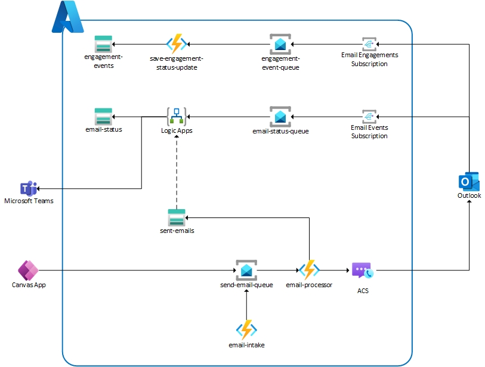

# Azure Communication Services Email

## About

Azure Communication Services Email is capabable of high transactional and bulk email processing that enables Application-to-Person (A2P) use cases.  To demonstrate a subset of ACSE capabilities we will utilize the Azure resources listed below to deploy a serverless architecture that is capable of sending emails, tracking their status, and capturing engagements (link clicked).  Data will be persisted in a simple s

- Azure Communicaiton Services Email
- Event Grid System Topic
- Service Bus
- Logic Apps
- Function Apps
- Table Storage

## Architecture

The demo nis focused around a serverless arhictecture that is loosely coupled using Azure Functions, Logic Apps, Service Bus, and Event Grid. The serverless component enables optimal resource allocation by implementing elastic horizontal scaling based on demand. Service Bus ensures we have transactional insight into messages and events, and should there be a processing error we can review messages in the dead-letter queue. Event Grid is responsible for routing system events to the appropriate queue for messaging. ACSE generates two types of system events:

- `Microsoft.Communication.EmailDeliveryReportReceived`
- `Microsoft.Communication.EmailEngagementTrackingReportReceived`

Each message is routed to an appropriate queue based on our subscription.  Once they arrive in their desitnations processing is doing using a FunctionApp or LogicApp -- all depending on the event type. The Event Grid subscriptions will also promote some properties to aid in our routing and processing of events.

Later on in this document we'll walk through editing one our LogicApp Workflow to enable integration with Teams.  We'll use this integration to post message delivery updates in a teams channel when we've been informed of a dropped message.

### System Design



## Setup

To quickly deploy resources and code for testing navigate to `infrastructure/terraform/azure-communication-services`. There you will see a deployment powershell script that will walk you through resource creation.  The script has one mandatory parameter, `tfvars_file`.  Use the `demo.tfvars` located in the same directory as the input. You can make any changes you need in the vars file to change deployment configurations -- such as location, names, etc.

```powershell
.\deployment.ps1 -tfvars_file demo.tfvars
```

The script will prompt you to perform the following actions:

- az login
- terraform plan, validate, apply
- function app deploy
- logic app deploy

> :globe_with_meridians:
> Azure Communication Services and Event grid will be deployed under the `global` location

To send a test message you can send a `POST` message to the `email-intake` function.

```json
// Sample email request
{
    "To": [
        "user1@your_domain.com",
        "user2@your_domain.com",
    ],
    "Subject": "Subject line!",
    "Body": "<p>Supports HTML tags!</p>",
    "Importance": "Normal"
}
```

This function is a simple frontend to intake queue.  It will take the HTTP request, parse the body, validate it, and if valid submit it to the queue.  Once the message has arrived in the queue the `email-request-processor` function will build a message and send it to ACS for transmit.  The interaction with ACS is done through the ACS sdk [Azure.Communication.Email (1.0.0-beta.1)](https://www.nuget.org/packages/Azure.Communication.Email). 
